# 综合案例-图书管理系统

# 1  登录页面

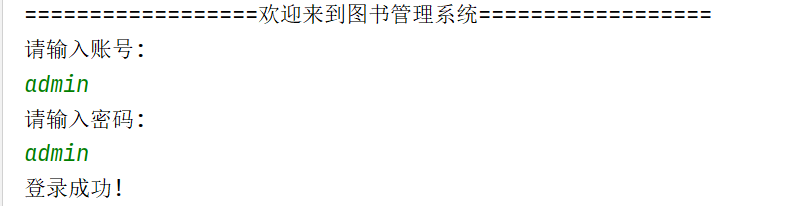

# 2  主界面

## (1)管理员

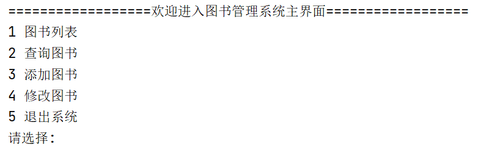

## (2)普通用户

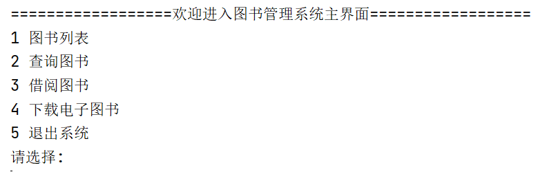

# 3 显示所有图书

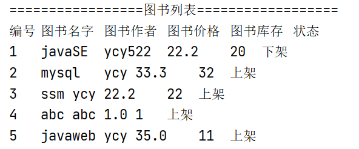


# 4 查询图书

## (1)根据图书名查询

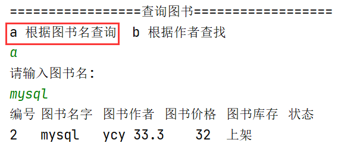

## (2)根据作者查询

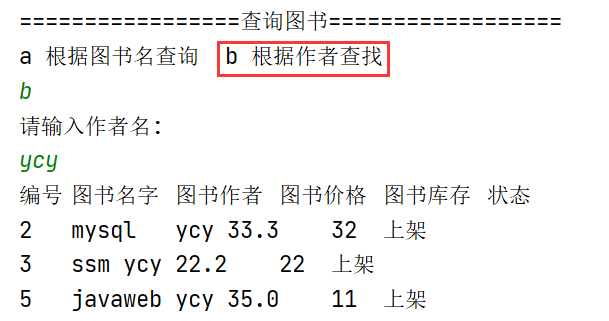


# 5  添加图书

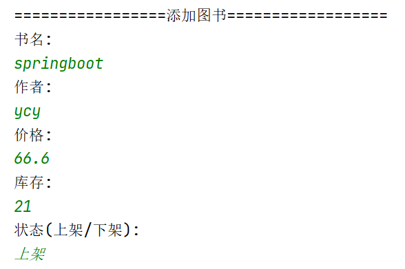

```
查询添加后的图书列表:
```

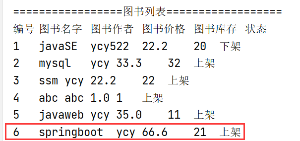

# 6 修改图书

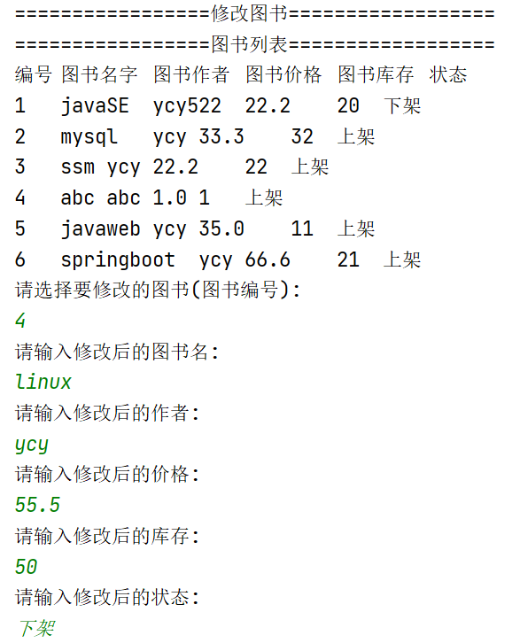

```
查看修改后的图书列表
```

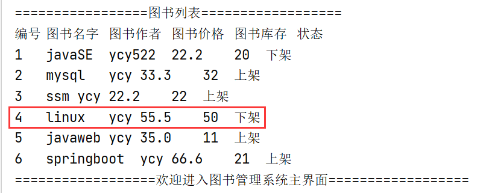

# 7  借阅图书


```
查看借阅后的图书列表:
```

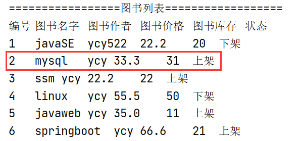

# 8 下载电子图书

```
下载前:download目录为空
```


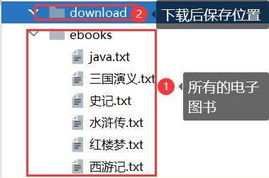

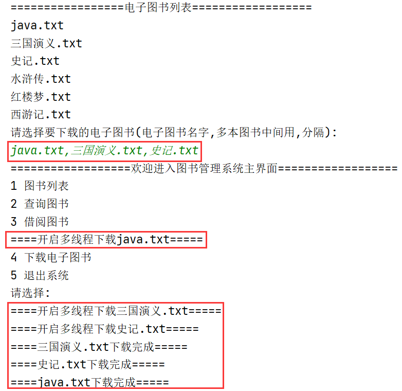

```
下载后:download目录有文件
```

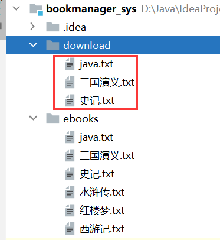


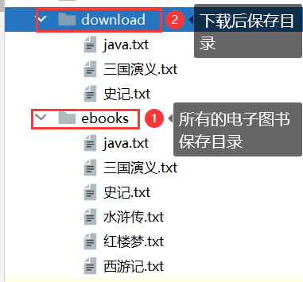


 

# 9 退出系统

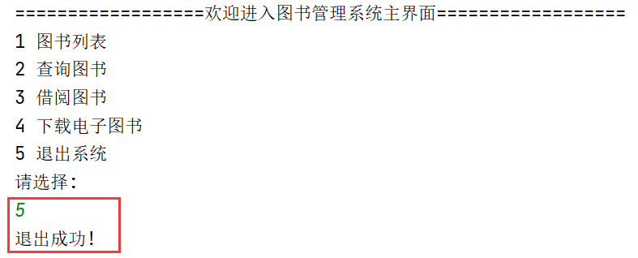

