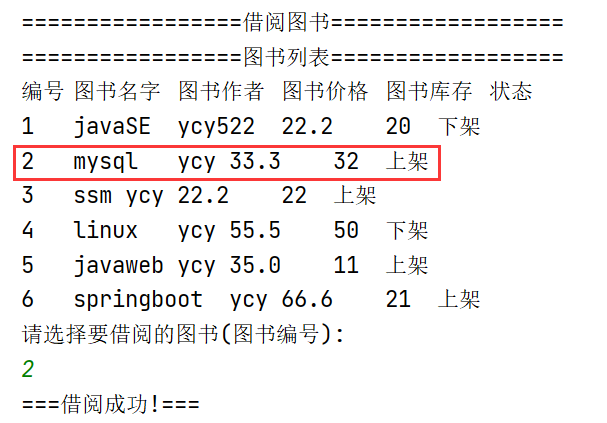

# 综合案例-图书管理系统

# 1  登录页面


# 2  主界面

## (1)管理员


## (2)普通用户


# 3 显示所有图书


# 4 查询图书

## (1)根据图书名查询


## (2)根据作者查询


# 5  添加图书


```
查询添加后的图书列表:
```


# 6 修改图书


```
查看修改后的图书列表
```


# 7  借阅图书



```
查看借阅后的图书列表:
```


# 8 下载电子图书

```
下载前:download目录为空
```


```
下载后:download目录有文件
```


 

# 9 退出系统


